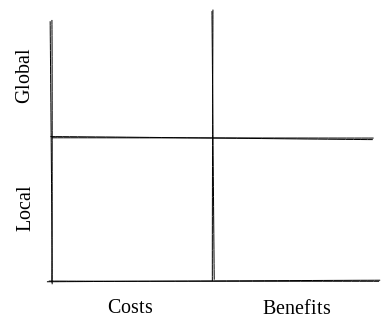

## From Corporations to Nations: How the Meta-DAO is Going to Change Everything (Part 1)

Are you tired of being held back by traditional institutions that prioritize bureaucracy over individual autonomy and rational decision-making? Join us on a journey to explore the potential of the Meta-DAO, a new organization that uses code and markets to make decisions instead of professional managers. 

In this series, we will cover the following topics, with one post per topic:
- **Problem**: What is the problem that all institutions need to solve? 
- **Prior approaches**: What have been prior approaches to the problem?
- **Mechanics**: How does the Meta-DAO solve the problem?
- **Roadmap**: How will we get there, and how can you benefit by engaging?

## What is the problem that all institutions need to solve?

**TL;DR**:
- All institutions, regardless of their size or type, face the challenge of aligning their members' actions with the institution's goals.
- Global costs and benefits refer to effects that impact the institution as a whole, while local costs and benefits refer to effects that impact the individual taking the action.
- The best scenario is when people take actions if, and only if, they predict that the action's global benefits will outweigh the action's global costs.
- However, humans tend to make decisions based on a 'greedy' or 'irrational' algorithm that focuses on local costs and benefits or conformity with peer groups.
- The problem is designing an institution in such a way that they simulate the ideal.

--- 

Institutions are ubiquitous in human society, ranging from small cooperatives to massive multinational corporations and nation-states. Despite their varied forms and functions, all institutions share a common challenge: **how to ensure that the actions of their members are aligned with the institution's goals**.

To further understand this problem, we can analyze the effects of actions along two axes: global versus local, and costs versus benefits. We encapsulate this in the following matrix:



Global costs and benefits refer to effects that impact the institution as a whole, while local costs and benefits refer to effects that impact the individual taking the action. If you would like a concrete example of this, see the appendix.

From the institution's perspective, the best scenario is when people take actions if, and only if, they predict that the action's global benefits will outweigh the action's global costs. In other words, it would be ideal if humans followed this algorithm:

```rust
if predicted_global_benefit(action) > predicted_global_cost(action) {
    do(action);
} else {
    disregard(action);
}
```

Unfortunately, humans do not tend to make decisions in this way. Much more common is a 'greedy' decision-making algorithm where a human takes an action if, and only if, they think it will benefit them. Represented in code, this is the following: 

```rust
if predicted_local_benefit(action) > predicted_local_cost(action) {
    do(action);
} else {
    disregard(action);
}
```

Also common is the 'irrational' or 'conformist' algorithm, which may look something like this:

```rust
if peer_group_is_doing(action) {
    do(action);
} else {
    disregard(action);
}
```

Either way, these are a far cry from the ideal. The problem that confronts us is designing an institution in such a way that it *simulates* the ideal. In other words, our task is to make the institution behave like all of its members are folllowing the ideal decision-making algorithm.

Because of the magnitude of this problem, humans have tried solving it for millenia. In the next post, we will discuss some of their approaches.

Between now and then, you might want to consider times where you have been affected by this problem. Here are some examples:
- Have you observed a company manager shutter or fail to support a good project simply because it would create career risk for the manager?
- Do you live in one of the many countries where politicians have allowed the country to amass large amounts of debt because they are too focused on the next election cycle to solve the country's problems?
- Have you been venture capitalists more focused on conforming than on generating high returns (i.e., 'who else has committed?')

## Appendix 

### Example of global and local costs and benefits

Suppose that you work at a company as a marketing manager, and you have the opportunity to take on a new project that involves launching a controversial ad campaign. If the campaign is successful, it could generate a lot of attention for the company and help your career by demonstrating your ability to generate buzz. However, if the campaign is seen as offensive or insensitive, it could harm the company's reputation and hurt your career prospects in the long term.

In this example, the potential global costs and benefits are related to the impact of the ad campaign on the company as a whole (i.e., how it affects the company's reputation, sales, etc.), while the local costs and benefits are related to the impact of the campaign on your personal career prospects (i.e., how it affects your professional image and future job opportunities).
