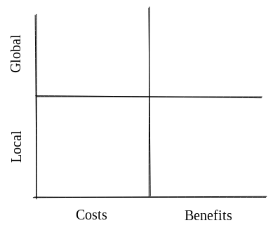
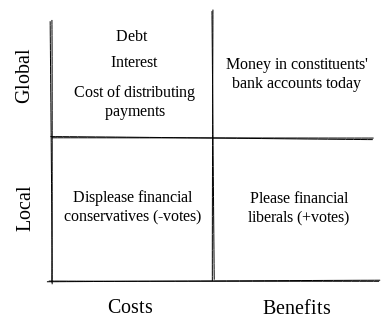
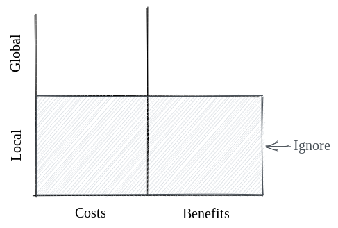
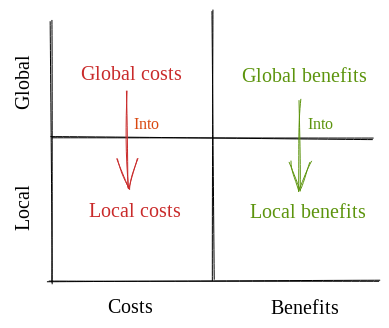

## Why build the Meta-DAO (Part 2)

This post is designed to answer two questions:
- What *exact* problem is the Meta-DAO designed to solve? 
- How did humans deal with this problem before?

## The Problem

In any given institution (an economy, a firm, a nation, etc.), decisions need to be made. These decisions have consequences. We can group these consequences into two categories:
- **local consequences**: those that impact the person who's making the decision
- **global consequences**: those that impact the members of the institution as a whole

We can also divide consequences into those that are **harmful** and **beneficial**.

This maps onto the following matrix:



Suppose that a politician is deciding whether or not to distribute cash payments to his or her constituents during an economic downturn. We can map this action onto the matrix like so:



In general, we want decision-makers to take actions iff their global benefits outweigh their global costs. 

Stated in other terms, we would like decision-makers to follow the below algorithm.

```rust
// ideal decision-maker algorithm
if expected_global_benefit(action) > expected_global_cost(action) {
    do(action);
} else {
    disregard(action);
}
```

Observe that this algorithm optimizes for "the greatest good for the greatest number." By definition, it is the best algorithm for the institution's stakeholders as a whole.[^1]

You may observe a problem here, which is that most humans do not follow this algorithm when deciding whether to take an action. From this, we see the crux of the problem: **how do you design mechanisms such that an institution functions like all of its members are following the ideal decision-maker algorithm?** This problem will make more sense as we explain prior approaches.

## Prior approaches

There have been three prominent approaches to this problem. We will call these:
- Philosopher kingdoms 
- Aligning incentives 
- Atomize! 

### Philosopher kingdoms




Plato first described this approach in *The Republic*. He thought that most people were dumb and/or greedy, but that some were both intelligent and altruistic. A philosopher kingdom tries to identify these individuals and then gives them all the power. The theory is that they will ignore their local costs and benefits and only focus on the betterment of the group as a whole.

- founder-led companies
- catholic church
- dictatorships

### Internalize decision-maker externalities

Another approach is to say, 'okay, humans aren't alruistic, but what if I can design decision-maker incentives such that what's in the interest of the group is in their interest?'



This approach has had varying degrees of success. In markets, where profit-maximizers need to produce things of value to maximize their profits, it's been very successful. It's had *some* success in the following instantiations:
- Cultures & religions that praise altruists (honor, virtue, loving thy neighbor, etc.)
- Management and employee stock plans
- Democracies
- Public companies
- Hierarchical bureaucracies

These systems all have their own shortcomings. A common one across cultures, religions, democracies, and public companies, is that they each suffer from tragedies of the commons. For example, a shareholder of a public company has a very limited incentive to determine which board members are pushing the company forward instead of just pushing their career forward. This is also why token-voting DAOs won't work over the long-term.

## The Meta-DAO's approach


[^1]: Those of the libertarian political persuasion might feel unease when reading statements such as this. It is really only the anarchists (a tiny fraction of the population) who is fundamentally opposed to this statement. Consider, for example, homicide laws. The vast majority of people would be against the legalization of homicide. Why? Because most humans would value human life more than any benefit the killer would likely achieve. However, when the scales are flipped, and killing the person would bring about global benefits (e.g., a terrorist leader, a genocidier, Hitlet, et cetera), more people are inclined to believe that killing is okay. It is always a matter of global costs and benefits; different political groups are usually in contention over the best method of maximizing global welfare. Communists believe that global welfare is best maximized under controlled economies; neoliberals believe that it is best maximized under free markets and democracies; et cetera.