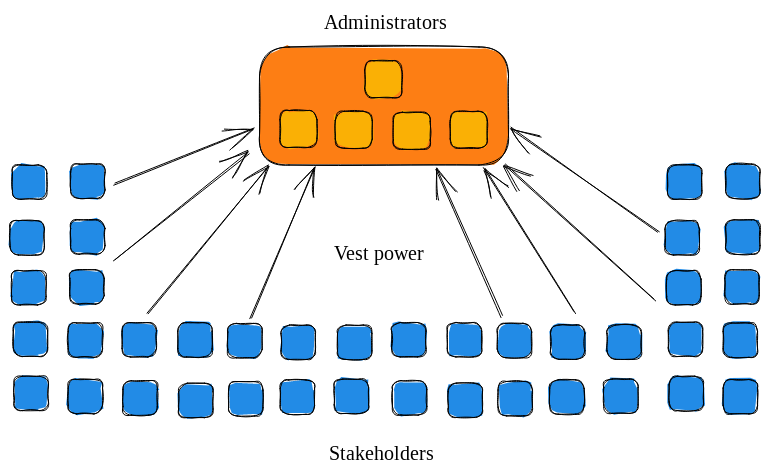
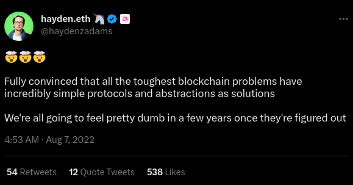

## Why build the Meta-DAO (Part 2)

This post is designed to answer two questions:
- What *exact* problem is the Meta-DAO designed to solve? 
- How did humans deal with this problem before?

## The Problem

In any given institution (an economy, a firm, a nation, etc.), decisions need to be made. These decisions have consequences. We can group these consequences into two categories:
- **local consequences**: those that impact the person who's making the decision
- **global consequences**: those that impact the members of the institution as a whole

We can also divide consequences into those that are **harmful** and **beneficial**.

This maps onto the following matrix:


Suppose that a politician is deciding whether or not to distribute cash payments to his or her constituents during an economic downturn. We can map this action onto the matrix like so:


In general, we want decision-makers to take actions iff their global benefits outweigh their global costs. 

Stated in other terms, we would like decision-makers to follow the below algorithm.

```rust
// ideal decision-maker algorithm
if expected_global_benefit(action) > expected_global_cost(action) {
    do(action);
} else {
    disregard(action);
}
```

Observe that this algorithm optimizes for "the greatest good for the greatest number." By definition, it is the best algorithm for the institution's stakeholders as a whole.[^1]

You may observe a problem here, which is that most humans do not follow this algorithm when deciding whether to take an action. From this, we see the crux of the problem: **how do you design mechanisms such that an institution functions like its members are following the ideal decision-maker algorithm?** This problem will make more sense as we explain prior approaches.

## Prior approaches

There have been three prominent approaches to this problem. We will call these:
- Philosopher kingdoms 
- Aligning incentives 
- Atomize! 

### Philosopher kingdoms

Even if not every human follows the optimal decision-making algorithm, it is possible that some people do. This is the key insight behind philosopher kingdoms, as described by Plato in *The Republic*.

Simply, the idea is as follows:
- Find and cultivate clear-thinking altruists, those who ignore local costs and benefits and instead only care about global costs and benefits.
- Consolidate all power to make decisions in them.


We can see something akin to this in states where religious leaders have a lot of power, such as the historical Holy Roman Empire or the modern-day Islamic Republic of Iran. Communist states are another example.

There are many problems with philosopher kingdoms. Chief among these is finding true altruists who would ignore local costs and benefits. If any humans exist like this, they are few and far between.

### Aligning incentives

As mentioned, the world does not contain many true altruists. On the other hand, quite a few people follow the 'greedy' decision-making algorithm depicted below.

```rust
// greedy decision-maker algorithm
if expected_local_benefit(action) > expected_local_cost(action) {
    do(action);
} else {
    disregard(action);
}
```

A more practical approach, and one that has gained wide adoption, is to 'align incentives.' In other words, to *create* local costs that correspond to global costs and local benefits that correspond to global benefits.


When incentives are aligned perfectly, humans following the greedy decision-maker algorithm will make decisions as if they were following the optimal algorithm. 

Some examples of this principle at work include:
- **Democracies**: since politicians are elected by voters, politicians want to do things that make voters happy and avoid doing things that make voters unhappy.
- **Public companies**: like democracies, only where professional managers are elected by shareholders. Most public companies also attempt to incentivize their management teams through stock ownership.
- **Hierarchical bureaucracies**: like democracies, only where employees are hired and fired by managers. 
- **Ethical systems**: most cultural and religious ethical systems find it virtuous to create global benefits and immoral to create global costs. The Golden Rule and most of the Ten Commandments are examples of this. When an institution shares these beliefs, social status is given to those who create global benefits and is taken from those who create global costs.

Although better than philosopher kingdoms, aligning incentives has its own list of shortcomings. The most important among these are information and incentives. 

For example, consider the cases of public companies and democracies. Both follow a similar structure where a group of stakeholders (shareholders or constituents) vests power in a central group of administrators. These administrators are expected to serve the interests of the stakeholders.



The problem is that while it is in the interest of the stakeholders as a group to watch over the administrators, each stakeholder only has a small incentive to do so. Most citizens do not look up the voting records of their political representatives. Most shareholders do not vote in proxy meetings. Without this feedback, the administrators end up weighing global costs and benefits much less than would be in the interest of the stakeholders.

### Atomize!

One way to get around the fundamental problem of institutions is to stop using them. 


To demonstrate, consider the hypothetical city of Burokratio. 

In Burokratio, the politicians always promise to follow the ideal decision-maker algorithm but always end up following the greedy algorithm. Instead of making any decisions or managing government affairs, they spend all of their time attending political rallies and handing out government money to those that attend.

Eventually, the citizens of Burokratio get tired of this routine, and each 





#### Footnotes

[^1]: Those of the libertarian political persuasion might feel unease when reading statements such as this. It is really only the anarchists (a tiny fraction of the population) who is fundamentally opposed to this statement. Consider, for example, homicide laws. The vast majority of people would be against the legalization of homicide. Why? Because most humans would value human life more than any benefit the killer would likely achieve. However, when the scales are flipped, and killing the person would bring about global benefits (e.g., a terrorist leader, a genocidier, Hitlet, et cetera), more people are inclined to believe that killing is okay. It is always a matter of global costs and benefits; different political groups are usually in contention over the best method of maximizing global welfare. Communists believe that global welfare is best maximized under controlled economies; neoliberals believe that it is best maximized under free markets and democracies; et cetera.