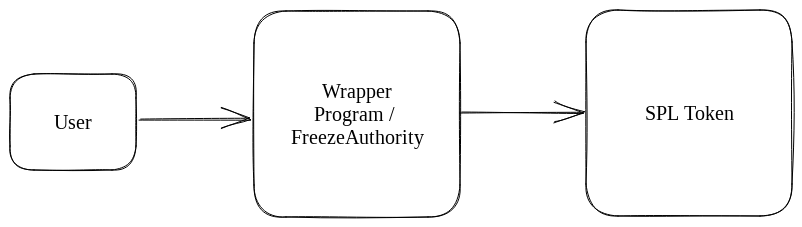

## sRFC 00014: Rethinking SPL Token

### Summary

This sRFC describes the current problem with the SPL token program, that all requests flow through the same codepaths. This leads to performance degredation (e.g., even non-freezable tokens need to go through the freeze check code path) and large barriers to innovation (if your token requires a logic change, you need to convince the community to either change the SPL token program or accept your alternative token program). To address this problem, this sRFC raises a number of potential solutions, including a system where SPL token (or a replacement) would be more modular, allowing arbitrary functionality without compromising on security. There remain a number of open questions about how this could and should be accomplished, listed at the end.

### Problem

One of the biggest differences between the SVM and the EVM is the SVM's [separation of state and code](https://docs.solana.com/developing/programming-model/accounts). This mechanism is useful because it allows users to specify which state they will access and write to, thus enabling parallel processing of transactions. However, it has also had an less-desirable consequence: tightly coupling interfaces and implementations.

This is especially important in reference to Solana tokens. On EVM chains, there is a standard [ERC20 interface](https://eips.ethereum.org/EIPS/eip-20), but no standardized ERC20 implementation. In practice, many projects use battle-tested implementations such as [OpenZeppelin](https://github.com/OpenZeppelin/openzeppelin-contracts/blob/9a2e4cb3a71326bc91a177f7b1f184448ccc799f/contracts/token/ERC20/ERC20.sol) or [Solmate](https://github.com/transmissions11/solmate/blob/2001af43aedb46fdc2335d2a7714fb2dae7cfcd1/src/tokens/ERC20.sol). However, importantly, many teams have needed to create their own implementations because of their novel use-cases. Examples of this include MakerDAO with [DAI](https://etherscan.io/token/0x6b175474e89094c44da98b954eedeac495271d0f#code),  Compound with [cTokens](https://compound.finance/documents/Compound.Whitepaper.pdf), and OlympusDAO with [OHM](https://etherscan.io/token/0x383518188c0c6d7730d91b2c03a03c837814a899#code). Cumulatively, these projects and their intellectual offshoots have brought tens of billions of dollars to DeFi. Basically, although the EVM has many problems (non-parallel, re-entrancy, etc.), decoupling implementations from interfaces has been a big boon to the ecosystem.

On Solana, tokens work differently. Not only is there a shared interface, but all projects must use the same [shared implementation](https://github.com/solana-labs/solana-program-library/tree/master/token/program) if they want their tokens to be adopted by the broader ecosystem. This means that every SPL token instruction, such as a transfer, flows through the same codepath. There are two negative consequences of this:
- **Performance degredation**: *because everyone shares a common implementation, that implementation must contain all features that any concievably important token would want.* The result of this lowest common denominator approach is that token instructions flow through unnecessary codepaths. For example, [all transfers check if the source and destination accounts are frozen](https://github.com/solana-labs/solana-program-library/blob/6ab6e81531eb02fdc68d35871c1c4977c22459d8/token/program/src/processor.rs#L243-L245), even if a token doesn't need / isn't using the freeze functionality. Even if these degregations are small on a per-transaction basis, the token program is so popular that speedups in the token program could concievably speed up the entire network.
- **Raised barriers to innovation**: from [the Solana docs](https://spl.solana.com/token-2022): "As more developers have come to Solana with new ideas, however, they have forked the Token Program to add functionality. It's simple to change and deploy the program, but it's difficult to achieve adoption across the ecosystem." An example of functionality that is difficult / impossible to achieve in the current token program is rebasing, where one's balance automatically increases or decreases with time. But the point of this sRFC is not to raise examples of specific functionality that needs to be improved, because the most important examples are probably ones that the author wouldn't think of. The whole point of general-purpose blockchains is permissionless innovation, a system where developers can deploy financial innovation in the same way that they deploy an open-source software package. As it stands, this is not possible. Neither will this change with [Token-2022](https://spl.solana.com/token-2022), which increases functionality but doesn't lower barriers to innovation. This approach can be analogized to the Web before Javascript, when new functionality required introducing a new html tag.
- **Opaque governance**: see below comment in Discord.

Ideally, a Solana token design would have the following properties:
- **Common interface**: obviously, it would not be ideal if programs needed to craft different instructions for different tokens.
- **A single program ID**: as stated in the Solana docs, "Solana's programming model requires programs to be included in transactions along with accounts, making it complicated to craft transactions involving multiple token programs." As such, a single program ID would be ideal.
- **Sensible defaults**: many developers are just going to want to use a default implementation that has already been battle-tested; Solana tokens should allow for this.
- **Permissionless innovation**: developers with a new idea for a token mechanism shouldn't be required to engage a committee or the community as a whole in order to deploy their token.

### Solutions

#### Wrapper contract

One idea discussed by @johncinque somewhere (I can't remember where, hence no link) is to have a wrapper contract that automatically freezes all token accounts. Only the wrapper contract can unfreeze them, so as a token developer, you can add additional logic in this wrapper contract and then impose it upon the user. For example, you could keep track of the total volume of transfers ever sent by incrementing a counter every time a transfer happens.

The problem with this is that it doesn't *really* help with permissionless innovation. What are the odds OpenBook, Drift, or other DeFi apps are going to support your custom wrapper? Slim at best. What about wallets? Also slim at best, although you could possibly make your own custom xNFT for your users who use Backpack.

#### Change the runtime

One of the reasons why dApp developers are reluctant to support custom token programs is security. For example, to transfer tokens, you need to pass in the writable signed 'authority' / 'owner' account. For a user, this will be their normal wallet account. Passing this in is understandably scary, given that this program could now, for example, go off to Mango and close this user's perp position. 

One potential solution to this is to allow programs to have more fine-grained control over their CPIs. For example, if a program could say "call this program, but don't allow it to pass this signed account in other CPIs", that could get rid of the security risk. 

#### A modular token program

The final approach, and the one advocated by this sRFC, is to have a more modular token program. Like the existing token program, this program would be singleton, and other programs could support it in the same way that they do the current token program. Unlike the current token program, it would allow for arbitrary *back-ends*. 

### Open questions

