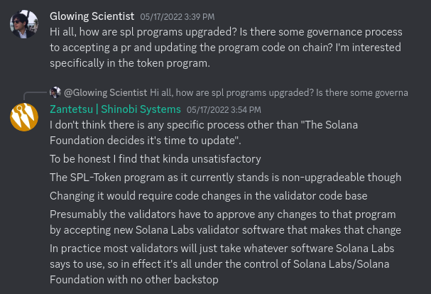

## sRFC 00014: Rethinking SPL Token

### **Summary**

This sRFC highlights a critical issue with the current implementation of the SPL token program: the tightly coupled interface and implementation. This results in performance degradation and significant barriers to innovation. To overcome these challenges, the sRFC proposes a modular token program that offers flexible functionality while maintaining security.

### **Problem**

One of the biggest differences between the SVM and the EVM is the SVM's [separation of state and code](https://docs.solana.com/developing/programming-model/accounts). This mechanism is useful because it enables parallel processing of transactions. However, it has also had a less-desirable consequence: tightly coupling interfaces and implementations.

This issue is particularly relevant to Solana tokens. Unlike EVM chains with a standard [ERC20 interface](https://eips.ethereum.org/EIPS/eip-20) and multiple implementations, Solana requires all projects to utilize the same shared implementation for token adoption within the ecosystem. Consequently, all token instructions flow through a common codepath. This presents two major drawbacks:

- **Performance degradation due to 'lowest common denominator' approach**: The shared implementation must accommodate all possible token features, even if they are unnecessary for certain tokens. As a result, token instructions often traverse unnecessary codepaths, leading to performance inefficiencies and increased data storage requirements. For example, [all transfers check if the source and destination accounts are frozen](https://github.com/solana-labs/solana-program-library/blob/6ab6e81531eb02fdc68d35871c1c4977c22459d8/token/program/src/processor.rs#L243-L245), even if a token doesn't need / isn't using the freeze functionality. Further, 66 bytes of the 75-byte mint account (88%) and 88 bytes of the 136-byte token account (65%) are only used for a subset of tokens. Given the mass-market adoption that Solana aims to achieve, these differences will add up to tens of millions of dollars of added cost to Solana end-users.
- **Raised barriers to innovation**: While the [Token-2022](https://spl.solana.com/token-2022) initiative aims to add more features, it fails to address the core problem of inhibiting permissionless innovation. Many projects on Ethereum, such as MakerDAO with DAI, Compound with cTokens, OlympusDAO with OHM, and others, have required custom token implementations tailored to their specific needs. The inability to create alternative token programs easily limits experimentation and adoption within the Solana ecosystem.
- **Opaque governance**: As the token program is singleton and unpredictable features are expected, it must be upgradeable. Currently, the governance of the token program is driven by Solana Labs, with validators theoretically having the ability to prevent an upgrade. However, this arrangement raises concerns about centralization and the lack of practical oversight by validators.

### **Solutions**

To address these issues, several potential solutions are proposed:

#### **Wrapper contract**

One idea discussed by @joncinque is the utilization of a wrapper contract that automatically freezes token accounts. Additional logic can be implemented in this wrapper contract, imposing it on users during token transfers. 

However, this approach does not sufficiently address the problem of permissionless innovation, as widespread support for custom wrappers from various applications and wallets is unlikely.

#### **Change the runtime to allow fine-grained control over CPIs**

Enhancing the Solana runtime to provide developers with fine-grained control over Cross-Program Invocations (CPIs) is another solution. Developers could specify specific access rights for callees, such as restricting the ability to pass signed accounts to other programs via CPIs. Similar to Linux's containerization tools, these runtime additions would offer enhanced security and control.

#### **A modular token program**

The advocated approach in this sRFC is the adoption of a modular token program. This program would allow anyone to create a token handler program and register it with the main token program. The token program would then pass along all calls to the relevant handler (this is defined at the mint), taking care to never pass along signed user accounts. It would do so through two means:
- Upon receiving an `initialize_x` call, such as `initialize_token_account`, it would pre-allocate any accounts and pass ownership to the handler. This way, users can prevent passing any account initialization 'payer' to the handler.
- Upon receiving a call where someone needs to be authorized (e.g., `from.authority`, in the case of a `transfer`), the token program would authorize the user on behalf of the handler and pass the handler a different signed account to signify that the relevant user has signed.

A proof-of-concept of such a program can be found [here](https://github.com/metaproph3t/modular-token.git).

### **Open questions**

- Should a token handler be able to specify extra accounts required for basic instructions like transfers? If so, how should this be standardized?
- How important is backwards-compatibility, and what steps can be taken to ensure compatibility with the existing SPL token? How would migration be facilitated?
- Are there any security vulnerabilities in this design, and if so, how can they be addressed?

### **Conclusion**

This proposal introduces a method for Solana developers to create new token mechanisms while preserving end-user security. Feedback and questions within this forum are greatly appreciated, particularly from esteemed SPL contributors such as @joncinque, @criesofcarrots, and @mvines.
