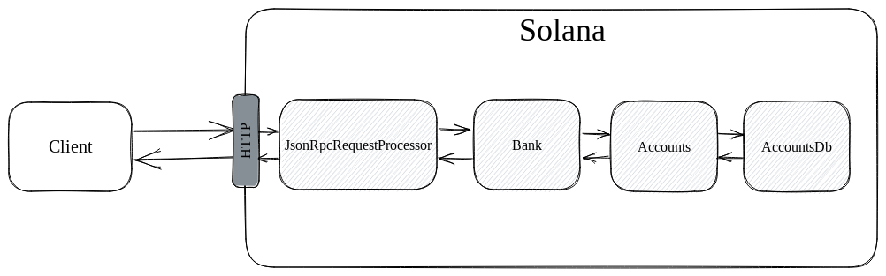
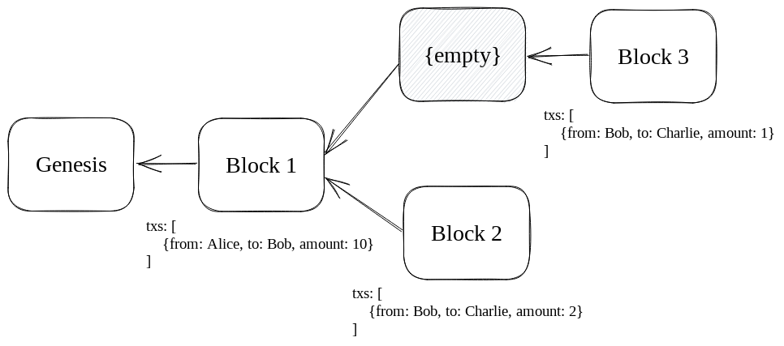

*In this series, we're going to dissect the Solana runtime's internals. By the end, you should have a decent grasp of how Solana processes transactions and responds to queries. Each post will take about 5 minutes to read.*

## Context

When you open up your Solana wallet, one of the first things it will do is fetch your SOL balance. It does this by making an API request like the following:

```bash
curl https://api.mainnet-beta.solana.com:8899 -X POST -H "Content-Type: application/json" -d '
  {
    "jsonrpc": "2.0",
    "id": 1,
    "method": "getBalance",
    "params": [
      "SysvarC1ock11111111111111111111111111111111"
    ]
  }
'
```

Here, we're pulling the balance of the clock account. If you put this in your terminal and press enter on your keyboard, you should see a response like this:

```
{"jsonrpc":"2.0","result":{"context":{"apiVersion":"1.13.5","slot":176778215},"value":1169280},"id":1}
```

In the response, `value` denotes the number of lamports (a unit of SOL) held by the account. Observe that the response also contains a few pieces of ancillary data, such as `apiVersion` and `slot`.

## Exploration

In this post, we're going to learn what Solana is doing between the time it receives the request and sends the response.

At a high-level, there are four components which service this request. These are:
- `JsonRpcRequestProcessor`: the entrypoint when anyone makes an RPC request, contains logic for handling those requests
- `Bank`: processes transactions and manages state, more on this later
- `Accounts`: a wrapper around `AccountsDb` that helps with concurrency and locks
- `AccountsDb`: responsible for storing accounts in memory and on disk



### **JsonRpcRequestProcessor**

Solana uses a library to pass JSON RPC calls to `JsonRpcRequestProcessor`, which makes it the first step along our journey. It has the following function: 

```rust
pub fn get_balance(
    &self,
    pubkey: &Pubkey,
    config: RpcContextConfig,
) -> Result<RpcResponse<u64>> {
    let bank = self.get_bank_with_config(config)?;
    Ok(new_response(&bank, bank.get_balance(pubkey)))
}
```

So this is the first thing that is called once your request passes basic validations. Observe that its interface corresponds 1:1 with the API request you made earlier. In our case, `pubkey` was the clock account's public key, `config` was the default because we didn't specify anything special, and `RpcResponse<u64>` corresponded to: `"result":{"context":{"apiVersion":"1.13.5","slot":176778215},"value":1169280}`. The only thing the function doesn't control is the `"jsonrpc":"2.0"` and `"id": 1`, which are automatically included in the response.

Shifting our attention to the function's internal logic, we see that it does three things of note:
1. creates a variable called `bank`, storing in it the result of `self.get_bank_with_config(config)?`
2. calls `bank.get_balance(pubkey)`
3. uses `new_response` to create a formatted response containing the output of the `get_balance` call

Note that most of the heavy lifting here is done by the bank.

### **Bank**

This brings us to the second step along our journey, the `Bank`. This is the hardest-to-understand component of the four, and is best explained by returning to the fundamentals of blockchains.

One of the challenges of blockchains is keeping the state consistent with the canonical ledger. For example, let's say we have a simple blockchain that keeps track of token balances. At genesis, Alice was given 100 tokens. Since then, two blocks have been mined, one where Alice sent Bob 10 tokens and one where Bob sent Charlie 2 tokens.


Here, the canonical ledger looks like:
```
[
    {from: Alice, to: Bob, amount: 10},
    {from: Bob, to: Charlie, amount: 2}
]
```

Since Alice started with 100, the canonical state should look like the following:

| account | balance |
| ------ | --------|
| Alice  | 90 |
| Bob | 8 |
| Charlie | 2 |

The problem, of course, is that blockchains have forks. For example, there could be an alternative block 2, where Bob only sent 1 token to Charlie instead of 2.


So a node of this chain needs to store two different states, one for each potentially valid block. In Solana, a state that corresponds to a given fork is called a `Bank`. In our case, since we didn't specify any configuration options in our API call, `self.get_bank_with_config` will automatically return the "finalized" bank, which is the most recent bank that has been accepted as valid by the supermajority of staking validators (weighted by their respective stakes).

Now that we understand `Bank` at a high-level, let's look at the code.

```rust
impl Bank {
...
    pub fn get_balance(&self, pubkey: &Pubkey) -> u64 {
        self.get_account(pubkey)
            .map(|x| Self::read_balance(&x))
            .unwrap_or(0)
    }

    pub fn read_balance(account: &AccountSharedData) -> u64 {
        account.lamports()
    }
...
}
```

So `get_balance` is doing the following:
1. trying to fetch the account of this public key 
2. if the account exists, returning the value in its lamport field
3. if it doesn't exist, returning 0 (non-existent accounts are said to have 0 balance)

Below is the code for `get_account`. Most of this can be ignored, except for the fact that accounts are ultimately fetched by calling `self.rc.accounts.load_without_fixed_root(ancestors, pubkey)`. 

```rust
impl Bank {
...
    pub fn get_account(&self, pubkey: &Pubkey) -> Option<AccountSharedData> {
        self.get_account_modified_slot(pubkey)
            .map(|(acc, _slot)| acc)
    }

    pub fn get_account_modified_slot(&self, pubkey: &Pubkey) -> Option<(AccountSharedData, Slot)> {
        self.load_slow(&self.ancestors, pubkey)
    }

    fn load_slow(
        &self,
        ancestors: &Ancestors,
        pubkey: &Pubkey,
    ) -> Option<(AccountSharedData, Slot)> {
        self.rc.accounts.load_without_fixed_root(ancestors, pubkey)
    }
...
}
```

### **Accounts and AccountsDb**

Ok, so we've gone over how Solana needs to keep track of multiple states, one for each bank (potentially canonical ledger). But how is this actually stored? 

Back to our simple blockchain example, one way to store the two potential states would be to have two tables, like so:

#### **Table 1:**
| account | balance |
| ------ | --------|
| Alice  | 90 |
| Bob | 8 |
| Charlie | 2 |
#### **Table 2:**
| account | balance |
| ------ | --------|
| Alice  | 90 |
| Bob | 9 |
| Charlie | 1 |

But this is wasteful. In this example, this would mean storing Alice's balance twice, even though it hasn't changed. Maybe this doesn't seem so bad, since it's only one duplicate, but what if there were millions of accounts that remained the same between the two states, and that duplicating them would needlessly hog up memory and disk? So we can't do this.

The key to understanding what Solana *does* do is understanding how Solana produces blocks. On a blockchain like Bitcoin, nodes (miners) compete to produce the next block. You get forks when multiple miners produce valid blocks at the same time. 

*On Solana, block producers are scheduled.* This means that at a given time, there can only be one valid block. There are still forks, but they look more like the following:



This could occur, for example, if the validator who produced block 3 did not receive block 2 in time. 

Also, note that we call banks "in-flight" when they can still be rolled back and "finalized" or "rooted" when they have received supermajority vote and can no longer be rolled back.

The accounts database (`AccountsDb`) stores accounts of in-flight banks in an in-memory cache. If block 1 is finalized, this cache would look like the following:


| bank | account | balance |
| ---- | ------- | --------|
| 3    | Bob | 9 |
| 3    | Charlie | 1 |
| 2    | Bob | 8 |
| 2    | Charlie | 2 |

When a bank has been finalized, its accounts in the cache get flushed to disk. So, at this moment, the disk would look like the following:

| account | balance |
| ------ | --------|
| Alice  | 90 |
| Bob | 10 |

Now, how does the database get the state of an account at a given bank? Returning to the code, we saw the following line:
```rust
self.rc.accounts.load_without_fixed_root(ancestors, pubkey)
```

Here, `ancestors` contains a list of numbers, each number referring to an in-flight bank. It also includes the current bank, so the bank from block 2 would have an `ancestors` of `[2]` and the bank from block 3 would have an `ancestors` of `[3]`. If block 1 had still been in-flight instead of being finalized, their `ancestors` would be `[1,2]` and `[1,3]`, respectively. 

*Side note: if you are scratching your head, saying 'huh? a bank's ancestors include itself?', I think you are perfectly justified. It appears that the Solana Labs naming committee has not yet grappled with the logical properties of infinite regresses...*

Then, when an account is requested from the database, the database reponds in the following way:
1. scan through the cache, from higher banks to lower banks, to see if one of the cached accounts matches this public key and one of the provided ancestors
2. else, go to disk and return the account from there

For example, if bank 3 requested Bob's balance, the database would find Bob's account in the cache (with a balance of 9) and return it. If It requested Alice's account, it wouldn't find it in the cache, and would fetch it from disk.

## Conclusion

Hopefully that wasn't too bad and you were able to learn how Solana's runtime works at a deeper level.

Thanks to @mvines, @brooksprumo, and @t-nelson for enlightenment in the Discord.

