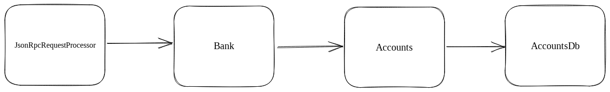
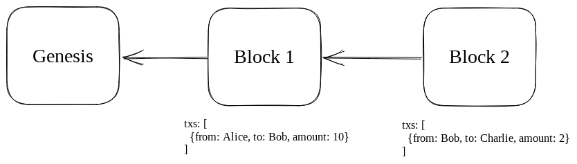
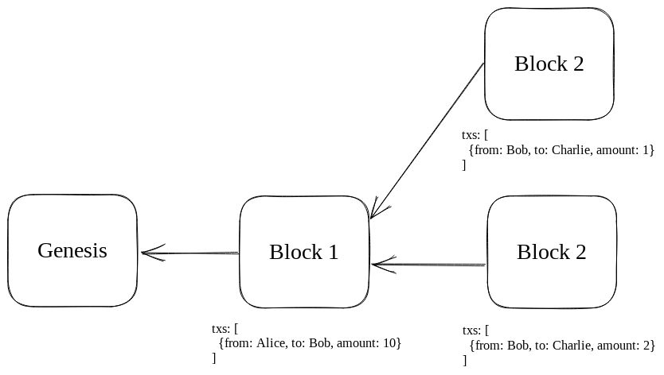

In this series, we're going to dissect the Solana runtime's internals. By the end, you should have a decent grasp of how Solana processes transactions and responds to queries. Each post will take about 5 minutes to read.

## getBalance()

When you open up your Solana wallet, one of the first things it will do is fetch your SOL balance. It does this by making an API request like the following:

```bash
curl https://api.mainnet-beta.solana.com:8899 -X POST -H "Content-Type: application/json" -d '
  {
    "jsonrpc": "2.0",
    "id": 1,
    "method": "getBalance",
    "params": [
      "SysvarC1ock11111111111111111111111111111111"
    ]
  }
'
```

If you put this in your terminal and press enter on your keyboard, you should see a response like this:

```
{"jsonrpc":"2.0","result":{"context":{"apiVersion":"1.13.5","slot":176778215},"value":1169280},"id":1}
```

In the response, `value` denotes the amount of SOL held by the account. So what happens between the time you press enter and the time you receive a response? 

At a high-level, the call flows through Solana as follows:



### JsonRpcRequestProcessor

The first destination along our journey is `JsonRpcRequestProcessor`, which has the following function: 

```rust
pub fn get_balance(
    &self,
    pubkey: &Pubkey,
    config: RpcContextConfig,
) -> Result<RpcResponse<u64>> {
    let bank = self.get_bank_with_config(config)?;
    Ok(new_response(&bank, bank.get_balance(pubkey)))
}
```

The interface looks reasonable. It accepts a reference to an account (`&Pubkey`) and returns a number corresponding to the number of lamports this account owns (`RpcResponse<u64>`).

To fetch the balance internally, the business logic calls `bank.get_balance(pubkey)`.

### Bank

One of the challenges people who build blockchains need to solve is keeping the state consistent with the ledger. For example, let's say we have a blockchain where two blocks have been mined after the genesis block. Block 1 contains a transaction where Alice sends 10 tokens to Bob, and block 2 contains a transaction where Bob sends 2 tokens to Charlie.



If blocks could never be rolled back, each node could keep a simple key-value store where keys are users' public keys and values are their balances. In this case, the state would look something like the following (in a world where Alice starts at 100 and everyone else starts at 0):

| account | balance |
| ------ | --------|
| Alice  | 90 |
| Bob | 8 |
| Charlie | 2 |

The problem with this approach is that there can be multiple competing ledgers. For example, there could be an alternative block 2, where Bob only sent 1 token to Charlie instead of 2.



So really, blockchains need to store state for each block 

TODO

The internals of `self.get_bank_with_config` aren't very interesting, so we'll just say that we've been able to declare a bank variable (via `let bank`) and store a reference to the canonical bank in it. `new_response` is also not very interesting, so we'll go straight to `bank.get_balance`. This is what's there:

```rust
impl Bank {
...
    pub fn get_balance(&self, pubkey: &Pubkey) -> u64 {
        self.get_account(pubkey)
            .map(|x| Self::read_balance(&x))
            .unwrap_or(0)
    }

    pub fn read_balance(account: &AccountSharedData) -> u64 {
        account.lamports()
    }
...
}
```

In English, this means:
(1) get the account for this public key
(2) if it exists, return the value in its lamport field
(3) if it doesn't exist, return 0

You can see the third statement in action when you call getBalance for a non-existant account. Instead of throwing an error, it will return 0. If you're curious what an account looks like in the internal representation, here's the struct:

```rust
pub struct AccountSharedData {
    /// lamports in the account
    lamports: u64,
    /// data held in this account
    data: Arc<Vec<u8>>,
    /// the program that owns this account. If executable, the program that loads this account.
    owner: Pubkey,
    /// this account's data contains a loaded program (and is now read-only)
    executable: bool,
    /// the epoch at which this account will next owe rent
    rent_epoch: Epoch,
}
```

If the `data` or `owner` fields are foreign to you, you may want to check out {insert resources here}.

The last thing we'll look at before wrapping up this post is the `get_account` function that the bank calls inside `get_balance`. Here it is:

```rust
impl Bank {
...
    pub fn get_account(&self, pubkey: &Pubkey) -> Option<AccountSharedData> {
        self.get_account_modified_slot(pubkey)
            .map(|(acc, _slot)| acc)
    }

    pub fn get_account_modified_slot(&self, pubkey: &Pubkey) -> Option<(AccountSharedData, Slot)> {
        self.load_slow(&self.ancestors, pubkey)
    }

    fn load_slow(
        &self,
        ancestors: &Ancestors,
        pubkey: &Pubkey,
    ) -> Option<(AccountSharedData, Slot)> {
        self.rc.accounts.load_without_fixed_root(ancestors, pubkey)
    }
...
}
...
struct Accounts {
...
    pub fn load_without_fixed_root(
        &self,
        ancestors: &Ancestors,
        pubkey: &Pubkey,
    ) -> Option<(AccountSharedData, Slot)> {
        self.load_slow(ancestors, pubkey, LoadHint::Unspecified)
    }

    fn load_slow(
        &self,
        ancestors: &Ancestors,
        pubkey: &Pubkey,
        load_hint: LoadHint,
    ) -> Option<(AccountSharedData, Slot)> {
        self.accounts_db.load(ancestors, pubkey, load_hint)
    }
...
}
