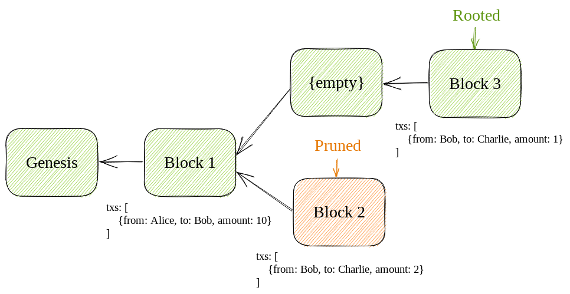

# Solana Internals, Part 1

*In this series, we're going to dissect Solana's internals. By the end, you should have a decent grasp of how Solana processes transactions and responds to queries. Each post should take about 10 minutes to read. The posts are targeted towards a technical audience.*

## Context

One of the most common ways that end-users interact with the Solana blockchain is by checking their SOL balance. Anytime someone opens up their wallet, their wallet will fetch their balance by making an API request to a Solana node. This is an example of such a request, which you can enter into your terminal and execute:

```bash
curl https://api.mainnet-beta.solana.com:8899 -X POST -H "Content-Type: application/json" -d '
  {
    "jsonrpc": "2.0",
    "id": 1,
    "method": "getBalance",
    "params": [
      "SysvarC1ock11111111111111111111111111111111"
    ]
  }
'
```

You should see a response like this:

```
{"jsonrpc":"2.0","result":{"context":{"apiVersion":"1.13.5","slot":176778215},"value":1169280},"id":1}
```

The lamport balance of the account is contained in the `value` field. Observe that the response also contains a few pieces of ancillary data, such as `apiVersion` and `slot`. In this post, we're going to explore how the validator populates this data.

## Deep dive

At a high-level, four components service this request:
- `JsonRpcRequestProcessor`: the entrypoint for all RPC requests, contains logic for handling those requests
- `Bank`: processes transactions and manages state, more on this later
- `Accounts`: a wrapper around `AccountsDb` that helps with concurrency and locks
- `AccountsDb`: responsible for storing accounts in memory and on disk


### **JsonRpcRequestProcessor** ([src](https://github.com/solana-labs/solana/blob/50f553e2452415690ac016c3d92849722fd2d168/rpc/src/rpc.rs#L625))

Once your request made its away across the internet, the validator passed it to `JsonRpcRequestProcessor`. Since you specified `getBalance` in the `method` field, it passed the request to `JsonRpcRequestProcessor`'s `get_balance` function, shown below.

```rust
pub fn get_balance(
    &self,
    pubkey: &Pubkey,
    config: RpcContextConfig,
) -> Result<RpcResponse<u64>> {
    let bank = self.get_bank_with_config(config)?;
    Ok(new_response(&bank, bank.get_balance(pubkey)))
}
```

Observe that the function's interface is

```rust
fn get_balance(&self, &Pubkey, RpcContextConfig) -> Result<RpcResponse<u64>>;
```

This should look familiar, given the RPC interface. We're passing in a public key and getting back a number corresponding to a lamport balance. If `RpcResponse` or `RpcContextConfig` look hazy to you, don't worry because we're going to come back to them.

Now let us shift our attention to `get_balance`'s internal logic.
```rust
let bank = self.get_bank_with_config(config)?;
Ok(new_response(&bank, bank.get_balance(pubkey)))
```
These two lines do three things of note:
1. create a variable called `bank`, storing in it the result of `self.get_bank_with_config(config)?`
2. call `bank.get_balance(pubkey)`
3. uses `new_response` to create a formatted response containing the output of the `bank.get_balance` call

`new_response` is what creates the `RpcResponse`, which is what got converted into `"result":{"context":{"apiVersion":"1.13.5","slot":176778215},"value":1169280}`.

But what is a bank?

### **Bank** ([src](https://github.com/solana-labs/solana/blob/069ebb8081c2cd7a6d91adec471c84b1806ce214/runtime/src/bank.rs#L6203))

This brings us to the second step along our journey, the `Bank`. Instead of jumping straight into the code, let us unpack what the `Bank` is going at a high level. 

The `Bank` can be best explained in terms of the fundamental problem that it solves. This is the issue of keeping state consistent with the ledger. 

Suppose that we are building a simple blockchain that keeps track of token balances. All transactions will specify a `from`, a `to`, and an `amount`. Below is an example of a sequence of blocks that could occur on our blockchain.


After a validator processes block 2, the ledger would look like:
```
[
    {from: Alice, to: Bob, amount: 10},
    {from: Bob, to: Charlie, amount: 2}
]
```

Assumedly, Alice had some starting balance that funded her transfer to Bob; let us say that she started with 100. Hence, the state should look like the following:

| account | balance |
| ------ | --------|
| Alice  | 90 |
| Bob | 8 |
| Charlie | 2 |

The problem, of course, is that blockchains have forks. For example, there could be an alternative block 2, where Bob only sent 1 token to Charlie instead of 2 (maybe Bob is mischevious enough to double-spend but not mischevious enough to leave Charlie with nothing).


At this point, the blockchain has *two potential states*. It needs to either store or be able to construct both, because the blockchain needs this state to validate future transactions. Here, this is making sure that someone doesn't spend more than their balance. For example, if Bob sends a transaction for 9 tokens, this should be accepted on the top fork but rejected on the bottom fork.

Bringing it back to Solana, a `Bank` is just a state at a given block. Remember that `RpcContextConfiguration` object that got passed into `JsonRpcRequestProcessor`'s `get_balance`? This specifies which bank to process the request against. We didn't configure this in our API request, so it used the default, which is the latest bank that has been approved by 2/3rds of the active stake.

Now let us look at the code. Here is the `Bank`'s `get_balance` function that `JsonRpcRequestProcessor` called:

```rust
impl Bank {
...
    pub fn get_balance(&self, pubkey: &Pubkey) -> u64 {
        self.get_account(pubkey)
            .map(|x| Self::read_balance(&x))
            .unwrap_or(0)
    }

    pub fn read_balance(account: &AccountSharedData) -> u64 {
        account.lamports()
    }
...
}
```

In English: 
1. fetch the account of this public key
2. if the account exists, return the value in its lamport field
3. if it doesn't exist, return 0 (non-existent accounts are said to have 0 balance)

And if we pivot our attention to the `Bank`'s `get_account` function:

```rust
impl Bank {
...
    pub fn get_account(&self, pubkey: &Pubkey) -> Option<AccountSharedData> {
        self.get_account_modified_slot(pubkey)
            .map(|(acc, _slot)| acc)
    }

    pub fn get_account_modified_slot(&self, pubkey: &Pubkey) -> Option<(AccountSharedData, Slot)> {
        self.load_slow(&self.ancestors, pubkey)
    }

    fn load_slow(
        &self,
        ancestors: &Ancestors,
        pubkey: &Pubkey,
    ) -> Option<(AccountSharedData, Slot)> {
        self.rc.accounts.load_without_fixed_root(ancestors, pubkey)
    }
...
}
```

Really, this can all be boiled down to the single line of `load_slow`:

```rust
self.rc.accounts.load_without_fixed_root(ancestors, pubkey)
```

`self.rc.accounts` returns the `Accounts` object. So we're calling the `load_without_fixed_cost` function of the `Accounts` object, passing the `Bank`'s ancestors (don't worry if you don't know what this means yet) and the public key that the client passed in.

### **Accounts and AccountsDb**

This brings us to the last step along our journey, `Accounts` and `AccountsDb`. Collectively, these objects form Solana's account database. They contain too much code for a 10-minute read, so we will eschew the code in favor of a conceptual understanding of what these components do. 

Let us return our attention to the simple blockchain that we are building. Even if we have a `Bank` for each block, which allows you to interact with the different states, we still need to actually store these states in memory and on disk. 

A naive approach would be give each potential state its own table. For the competing blocks of our demonstration, their tables would look like so:

#### **Table 1:**
| account | balance |
| ------ | --------|
| Alice  | 90 |
| Bob | 8 |
| Charlie | 2 |
#### **Table 2:**
| account | balance |
| ------ | --------|
| Alice  | 90 |
| Bob | 9 |
| Charlie | 1 |

But, like the good engineer you are, you have probably noticed that this is wasteful. Specifically, we need to store Alice's balance twice, even though her balance is the same among the two potential states. At any given point, the total memory utilization of our state is *f * s*, where *f* is the number of potentially-valid forks and *s* is the size of our state. 

The way that Solana deals with this is by keeping the unchanged accounts on disk and account updates in an in-memory cache until they are finalized. To explain, let us look at a sample Solana chain:


Because blocks on Solana are scheduled into slots, with each slot having only one leader who can produce the block, you cannot have two competing block twos. But you *can* have a situation where the producer of block three hasn't received block two in time, and so also branches off of block one (if this seems like a distinction without a difference, allow me one minute to change your mind please).

When a transaction updates an account's state in a block this gets put into the in-memory cache. *Importantly, the database doesn't only store the updated account, it also stores the bank at which this account was updated.*

At this point, the in-memory cache would look like this:

| bank | account | balance |
| ---- | ------- | --------|
| 3    | Bob | 9 |
| 3    | Charlie | 1 |
| 2    | Bob | 8 |
| 2    | Charlie | 2 |
| 1    | Alice   | 90      |

A bank becomes finalized when validators that hold 2/3rds of the stake vote for that bank. At this point, account updates for that bank and any of the bank's ancestors get flushed from memory to disk.

For example, let us say that sufficient validators vote for block three, which finalizes it and means that block two can never be added to the chain.



At this point, validators will flush account updates from bank three and its ancestors (in this case, just block one) to disk. They will also prune any account updates that occur in banks that are earlier than but aren't an ancestor of the finalized bank. Block two is earlier than block three but isn't an ancestor, and so it will get pruned. 

After the validators perform this, the in-memory cache will be empty and the disk will look like this:

| account | balance |
| ------ | --------|
| Alice  | 90 |
| Bob | 9 |
| Charlie | 1 |

Now, how does the database get the state of an account at a given bank? Returning to the code, we saw the following line:
```rust
self.rc.accounts.load_without_fixed_root(ancestors, pubkey)
```

Here, `ancestors` contains a list of numbers, each number referring to an in-flight (unfinalized) bank. It also includes the current bank, so bank two would have an `ancestors` of `[2,1]` and bank three would have an `ancestors` of `[3,1]`. 

*Side note: if you are scratching your head, saying 'huh? a bank's ancestors include itself?', I think you are perfectly justified. It appears that the Solana Labs naming committee has not yet grappled with the logical properties of infinite regresses...*

Then, when an account is requested from the database, the database reponds in the following way:
1. scan through the cache, from more recent to older banks, to see if one of the cached accounts matches this public key and one of the provided ancestors; if it does, return it
2. else, go to disk and return the account from there

For example, if the user queries for Bob's balance at bank three before it's been finalized, the database will find the account in the cache. If they make the query after bank three is finalized, the database would instead fetch it from disk.

## Conclusion

Hopefully that wasn't too bad. You are now one step closer to mental mastery. Next, we'll look at how Solana simulates transactions.

Thanks to @mvines, @brooksprumo, and @t-nelson for enlightenment in the Discord.

