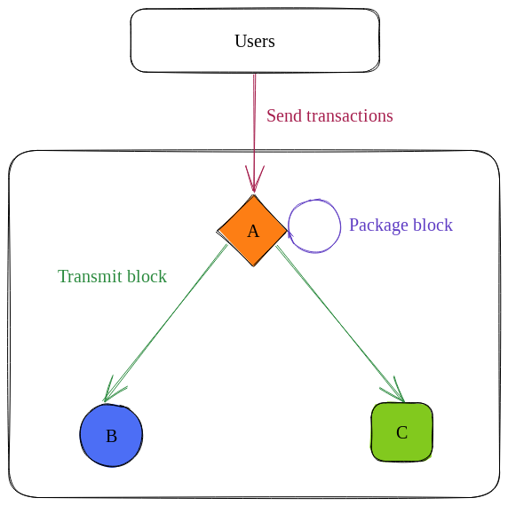
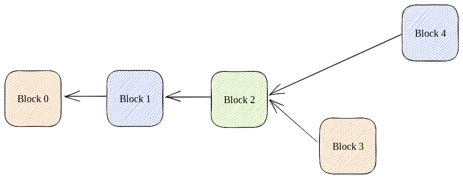

# Solana Internals, Part 2

*Much of this post is taken from Zantetsu's post here: https://www.shinobi-systems.com/primer.html. The value-add of this post is that it adds pictures and compresses the ideas down to a shorter post. I recommend anyone follow him @ShinobiSystems on Twitter.*

There are [8 key innovations](https://medium.com/solana-labs/7-innovations-that-make-solana-the-first-web-scale-blockchain-ddc50b1defda) that make Solana the first web-scale blockchain. One of the most important is Proof of History (PoH). Indeed, if Anatoly had not come up with PoH in a late-night brainstorm, Solana would not exist.[^1]

Most people in the Solana ecosystem understand *how* PoH works, at least at a high-level. Few understand *why* it is needed. This is what we will unpack in this post.

## Context

Suppose that you and two friends want to build a blockchain. Because you want the blockchain to be decentralized, each of you will run a node. Your nodes will take turns producing blocks, like this:

This is a *leader schedule*. A leader schedule is a sequence of adjacent time chunks called *slots*, where each slot has a designated leader (i.e., block producer). Note that in this example, slots are 1 second long. 

During each slot, the following happens:
1. The leader packages all user transactions into a block.
2. The leader transmits this block.
3. Validators forward the block until all validators have received it.

Remember that our slot times are 1 second long. What would happen if we made slots longer or shorter? 

Well, the obvious disadvantage of making them longer is that users would see more latency. If we made them, for example, 12 seconds long, some users might find it uncomfortable to stand there in silence with the person they are paying until the payment goes through.

*But* longer slot times can also prevent a pesky problem called *orphan blocks*. Suppose that 10% of the time, it takes 2 seconds for blocks to travel from A to B. In these cases, the block would not reach B until B's slot had already finished, so it would need to act like A had not produced a block. 

For example, if this happens during slot 3, the blockchain would look like this after slot 4:

At this point, we have a fork in the network. Validator C (the green one) could decide to build off of either block 3 or 4, but not both.

In general, forks are bad because they slow down the process of everyone coming to consensus on the blockchain's canonical state. If you sent a transaction to transfer tokens and it was included in block 3 but not block 4, while these forks are active you could no longer claim "I have x balance," you could only claim "these validators say I have x balance and these other validators say I have y balance."

If we had raised our slot time to 5 seconds, this issue would not have occured because B would have received A's block in time. Hence, picking a slot time is a balance between reducing user latency and reducing forks.

## PoH as a slot time enforcer

Whatever slot time you pick, you will want to ensure that nodes are actually following that slot time. For example, it would not do much good if you raised the slot time to 5 seconds but validator B kept only waiting 1 second for A's block.

[^1]: See *Whiteboard Series with NEAR | Ep: 2 Anatoly Yakovenko from Solana*, accessible here: https://youtu.be/rKGhbC6Uync.