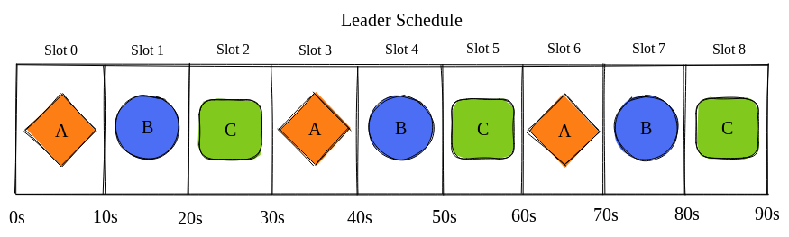
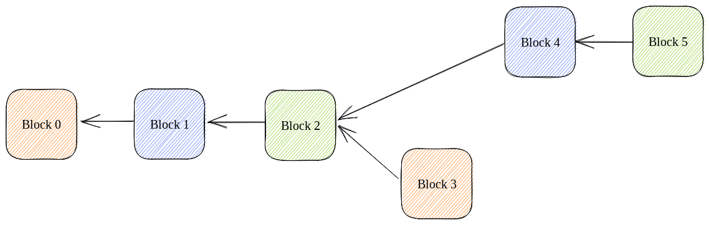
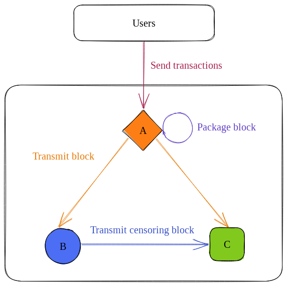
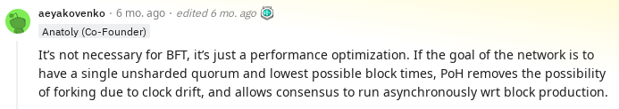

# Solana Internals, Part 2

There are [8 key innovations](https://medium.com/solana-labs/7-innovations-that-make-solana-the-first-web-scale-blockchain-ddc50b1defda) that make Solana the first web-scale blockchain. One of the most important is Proof of History (PoH). Indeed, if Anatoly had not come up with PoH in a late-night brainstorm, [Solana might not exist](https://youtu.be/rKGhbC6Uync).

Most people in the Solana ecosystem understand *how* PoH works, at least at a high-level (if you don't, I recommend this [video](https://youtu.be/rywOYfGu4EA). Few understand *why* it is needed. That's what we will unpack in this post.

## TL;DR:
- Blockchains with leader schedules, like Solana, require some mechanism to prevent leaders from 'jumping the gun' and transmitting blocks before their allotted time.
- On blockchains with longer slot times, such as Ethereum, validators can simply ignore blocks that are too early or too late.
- However, Solana targets 400ms times. Because of clock drift and propagation delay, the simple algorithm is no longer precise enough.
- With PoH, validators can *prove* that they haven't jumped the gun in a way that validators can asynchronously verify. Hence, Solana can maintain 400ms slot times.

## Context

Suppose that you and two friends are building a blockchain. Each of you will run a node and your nodes will take turns producing blocks.

To implement this, you create a *leader schedule*. This schedule divides time into 10 second *slots* and assigns one validator per slot.

During each slot, the following must happen:
1. The leader packages all user transactions into a block.
2. The leader transmits this block.
3. Validators forward the block until all validators have received it.

Since your blockchain contains only 3 validators, the third step won't be relevant, but you can imagine that it would be important on a blockchain with thousands of nodes like Solana.

Remember that your slots are each 10 seconds long. What would happen if you made them shorter?

The obvious advantage of shorter slot times is less latency. For example, if someone is using your blockchain to pay for their Starbucks, shorter slot times would mean that they spend less time at the counter waiting for their payment to go through.

On the other hand, shorter slot times also have an issue: increased risk of forking. 

For example, imagine that you try shrinking slot times to 1 second, like so:

You restart the blockchain with this change, and the first 3 blocks are processed normally. But then, this happens:

For some reason, block 4 got built off of block 2 instead of block 3. What do you think is happening here, anon?

The most likely culprit is that B didn't receive block 3 in time. Hence, it needed to build block 4 off of the most recent block it had received, block 2. Maybe A was in Manila, B was in Chicago, and the block encountered a slowdown on [CAP-1](https://www.submarinecablemap.com/submarine-cable/cap-1).

Whatever the culprit, we now have a fork in the network. And forks are bad, since until one of the forks has been selected as the *canonical ledger*, all of their state transitions (i.e., transactions) remain unconfirmed

Hence, in picking a slot time, your goal is to find the right balance between user latency and fork risk, also called orphan risk. The faster your nodes' internet speed, the lower slot times you can get away with, which is why Solana can get away with 400ms instead of Ethereum's 15s.

## PoH as a slot time enforcer

Unfortunately, your task doesn't end at picking a slot time. You also need to *enforce* that your chosen slot time is followed. 

For example, suppose that B didn't *miss* A's block but was actively *trying to censor* it. In other words, B decided to build off of block 2 not because it was the last block B had received but because B didn't want to build off of block 3.

If B can get C to build off of his block instead of A's, he will have suceeded in censoring A's block. This is because once the supermajority (B and C is 2/3) confirms a fork, conflicting forks cannot become a part of the canonical chain.

How could B go about his mischevious task? 

B *could* try simply waiting his turn and then submitting  a block 4 that builds off of block 2, but C is unlikely to build off of it. This is because C will have already received and voted on block 3, which disallows (by Tower BFT) C from voting on or building off of a block 4 that doesn't have block 3 as an ancestor.

Hence, B's best bet is 'jumping the gun,' transmitting his block to C before A transmits her block. In this case, B has a decent chance of C confirming and building off of his block.

Hence, we need to build a mechanism that prevents gun-jumping. 

In other blockchains, the algorithm for dealing with this is pretty simple: reject blocks that are too early and too late. This works because all of those chains have fairly long slot times. 

But Solana [targets 400ms slot times](https://github.com/solana-labs/solana/blob/ac8c31b5d6e2ff5f3a46f60ca23dab29bf3e2d27/sdk/program/src/clock.rs#L75-L76). This is makes Solana incompatible with the simple algorithm for the following reasons:
- Even small amounts of [clock drift](https://en.wikipedia.org/wiki/Clock_drift) could lead to validators incorrectly ignoring blocks (i.e., forking).
- Solana's large number of validators means that validators usually don't receive blocks directly from leaders but instead receive them [via multiple hops](https://medium.com/solana-labs/turbine-solanas-block-propagation-protocol-solves-the-scalability-trilemma-2ddba46a51db?source=post_page---------------------------).
- Even without multiple hops, [one-way trips between cities can sometimes be up to 300ms](https://wondernetwork.com/pings).

This is what PoH solves for. With PoH, you must *prove* that you waited a certain amount of time before transmitting a block. Importantly, validators can *asynchronously validate* that a leader waited the proper amount of time. No more gun-jumping! Or, in the words of our great high priest,

## Further reading

If you are still grappling with these concepts, I can recommend the following materials:
- [Zantetsu's primer](https://www.shinobi-systems.com/primer.html)
- [Anatoly's whiteboard session](https://youtu.be/rKGhbC6Uync)
- [Anatoly's post](https://medium.com/solana-labs/proof-of-history-a-clock-for-blockchain-cf47a61a9274)
- [Brandon Echter's post](https://solana.com/news/proof-of-history)

Distributed systems are complex, and Solana is more complex than most! Don't worry if it takes some time for it to 'click' mentally.
