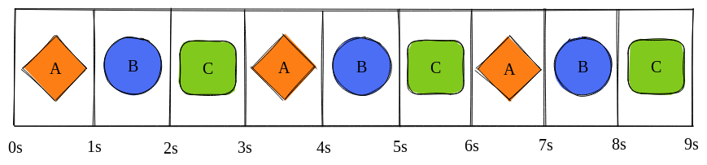
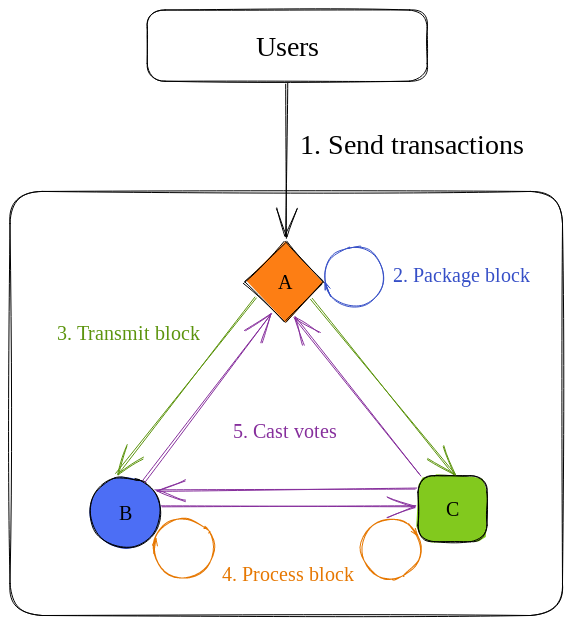

# Solana Internals, Part 2

*Much of this post is taken from Zantetsu's post here: https://www.shinobi-systems.com/primer.html. The value-add of this post is that it adds pictures and compresses the ideas down to a shorter post. I recommend anyone follow him @ShinobiSystems on Twitter.*

There are [8 key innovations](https://medium.com/solana-labs/7-innovations-that-make-solana-the-first-web-scale-blockchain-ddc50b1defda) that make Solana the first web-scale blockchain. One of the most important is Proof of History (PoH). Indeed, if Anatoly had not come up with PoH in a late-night brainstorm, Solana would not exist.[^1]

Most people in the Solana ecosystem understand *how* PoH works, at least at a high-level. Few understand *why* it is needed. This is what we will unpack in this post.

---

Suppose that you and two friends want to build a blockchain. Because you want the blockchain to be decentralized, each of you will run a node. Your nodes will take turns producing blocks, like this:

This is a *leader schedule*. Leaders are scheduled into *slots*, which are in this case 1 second long. During each slot, the following must happen:
1. The leader packages all user transactions into a block.
2. The leader transmits this block.
3. Validators forward the block until all validators have received it.
4. Validators ensure that the block is valid and replay its transactions onto their own state.
5. Validators attest to the block's validity by transmitting *votes*.

We need votes because we need some way of deciding what is the *canonical state*. They are what allows us to say things like "I own 10 SOL" instead of things like "validators A, B, and C say I own 15 SOL but validators D, E, and F say I own 5."

Remember that our slot times were 1 second long. This should be fine if all our validators have fast internet speeds and good hardware, but what if they don't? 

Imagine, for example, that it takes C 1 second just to process the block. If C has a fast internet speed, it may still be able to complete the whole process in 1.1 seconds. 

In the first block, this will not be much of an issue. But by the time A and B process the 100th block, C will be processing the 91st block. This can create all kinds of havoc, including C not being able to lead during its designated time and the blockchain taking a long time to come to consensus on new blocks.

Hence, in building a blockchain, we need to pick a sustainable slot time given the hardware and network speeds of our nodes. And we need to enforce that nodes are actually following this slot time.

PoH is the enforcement mechanism on Solana.

[^1]: See *Whiteboard Series with NEAR | Ep: 2 Anatoly Yakovenko from Solana*, accessible here: https://youtu.be/rKGhbC6Uync.